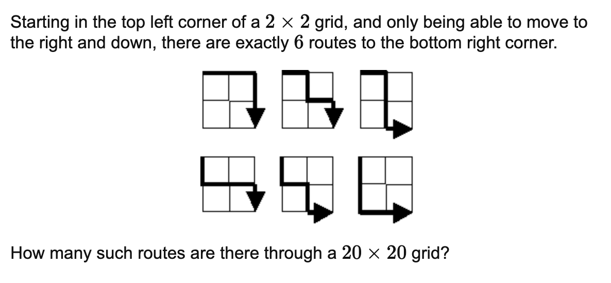
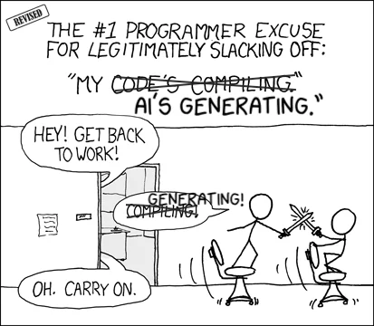
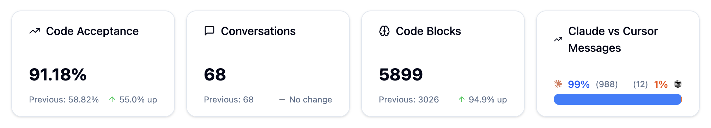

# Le *vibe coding* est en train de créer des programmeurs sans réflexion

*Traduction libre de l’article de [Namanyay Goel](https://nmn.gl/blog/vibe-coding-gambling#author-callout) —  
« [Vibe Coding Is Creating Braindead Coders](https://nmn.gl/blog/vibe-coding-gambling) »*

---

> **Confession :**  
> J’utilise Claude Code pour écrire pratiquement tout mon code.  Et je crois que ça me rend moins bon dans ce que j’aime faire depuis douze ans.

Je vois très clairement comment la programmation assistée par l’IA est en train de reconfigurer notre cerveau :  elle nous pousse à rechercher la gratification instantanée plutôt qu’une compréhension profonde, et transforme les développeurs en joueurs qui tirent un levier en espérant obtenir, encore une fois, du code qui fonctionne.

Si cela m’arrive à moi — quelqu’un qui a appris à programmer avant l’ère de l’IA — **qu’est-ce que ça fait aux développeurs débutants qui n’ont jamais connu autre chose?**

---

## Résoudre de vrais problèmes

À l’âge de 16 ans, seul dans ma chambre à New Delhi, j’étais complètement obsédé par un problème.

Ça provient d’un site appelé [Project Euler](https://projecteuler.net/), l’une des meilleures ressources pour relever des défis de programmation qui combinent les mathématiques avec les connaissances en structures de données et en algorithmique. Celui-ci en particulier est le problème 15 — “Lattice Paths”. Comme tous les problèmes de Project Euler, il peut être énoncé de façon assez simple.

Le problème nous montre déjà à quoi cela ressemble pour une grille 2×2, et il est facile d’en dessiner une 3×3 également (essaie, c’est la première chose que j’ai faite). Mais la véritable difficulté apparaît lorsqu’on tente d’imaginer l’ordre de grandeur du résultat : peux-tu seulement imaginer à quel point la valeur doit être énorme pour une grille de 20×20?

J’y ai passé des semaines : à griffonner des schémas sur tous les papiers possibles, à harceler mes profs de maths jusqu’à ce qu’ils m’évitent, et même à rêver d’algorithmes la nuit.

Peux-tu imaginer aujourd’hui passer des semaines sur un seul problème? Simplement réfléchir, échouer, puis réfléchir encore?

J’ai tout essayé. La force brute. La récursion. Dessiner des grilles jusqu’à en avoir les doigts engourdis. Rien ne fonctionnait.

Puis, un après-midi, dans l’autobus du retour de l’école, tout s’est éclairé. Ce n’était pas un problème de recherche de chemin.  

C’était une question de combinaisons. Pour atteindre le coin inférieur droit, il faut exactement 20 déplacements vers la droite et 20 vers le bas. La question peut donc être reformulée ainsi : de combien de façons peut-on organiser ces déplacements, ou encore, de combien de façons peut-on choisir 20 mouvements parmi 40?

Et c’est ce qui nous donne la réponse : **C(40, 20)**.

J’ai eu un petit moment *eurêka* qui m’a rendu euphorique jusqu’à mon retour à la maison.  
J’ai allumé mon PC et codé la solution en dix minutes.

J’ai obtenu la réponse : **137846528820**.

J’ai cliqué sur *submit* et l’écran de réussite de Project Euler est apparu, avec cette satisfaction pure : des semaines d’efforts qui culminaient enfin en un seul moment glorieux.

Mais voilà le point important — le nombre en lui-même n’avait aucune importance.

Ce qui comptait vraiment, c’était cet instant où tout s’est mis en place. Quand des semaines de confusion ont soudainement pris tout leur sens. Cet état de *flow*, d’immersion complète et de compréhension profonde.

Je n’aurais jamais ressenti cela si je n’avais pas passé tout ce temps à réfléchir au problème, ou si j’avais triché en cherchant la réponse en ligne.

Mais je ne l’ai pas fait. Et l’adrénaline que j’ai ressentie était tout simplement **magique**. J’étais tombé amoureux.

---

## L’addiction à l’IA

Il y a quelques mois, je faisais face à un vilain bug de gestion d’état. Évidemment, déboguer l’état dans `React` se situe tout en bas de l’échelle du plaisir —  
à peine mieux que d’essayer de naviguer sur Internet avec une connexion lente et des pertes de paquets.

Alors, par paresse, j’ai copié-collé tout le problème dans Claude pour le laisser s’en occuper.

Puis — et c’est là que ça commence à déraper — j’ai fait *alt-tab* vers X pendant qu’il « réfléchissait ».

Mais mon esprit a simplement fait : « ah, cool ». Je n’ai rien ressenti… vraiment rien.

Bon, ce n’est pas tout à fait vrai.

J’ai ressenti quelque chose — une satisfaction creuse, le fait que mon code fonctionne enfin. C’était le même sentiment que lorsqu’on fait du *doom scrolling* sur TikTok  ou qu’on termine un niveau de plus dans un jeu mobile. Ce petit coup de dopamine bon marché : « quelque chose vient de se passer ».

Si tu programmes avec l’IA, ça va peut-être te sembler familier :

Je lui envoie un prompt, avec les meilleures *vibes* possibles.  L’IA me dit qu’elle est en train de « réfléchir » (même si tout le monde sait qu’une IA ne réfléchit pas réellement — elle nous ment ouvertement au visage. Mais je souris à l’illusion… et j’y crois peut-être un peu.)

Je sais que ça va prendre une minute ou deux avant d’avoir la réponse. Qu’est-ce que je suis censé faire pendant ce temps-là? Réfléchir? L’IA va déjà le faire pour moi, beaucoup plus vite, et me donner le bon résultat (probablement).

Je reviens voir. C’est terminé. Petit pic de dopamine : ah, cool.

Je regarde le code (enfin… j’avoue : je lis surtout ce qu’elle me dit avoir écrit, pas le code lui-même). C’est "assez bon", mais évidemment l’IA a fait quelques mauvaises hypothèses, donc il reste des erreurs.

Je lui envoie un nouveau prompt pour corriger ça, et on recommence notre petite danse.

*On entre un prompt, on reçoit du code.*

*On tire le levier, on obtient une récompense.*

Aucune lutte. Aucune compréhension. [Aucune progression.](AI_jobs_danger_traduction.md)

---

## Le cerveau sous IA

Voici ce qui se passe réellement dans ta tête lorsque tu fais du *vibe coding* et que tu t’en remets entièrement à l’IA : tu obtiens de la [dopamine](https://fr.wikipedia.org/wiki/Dopamine) à partir de la mauvaise source.

Avant l’IA, la programmation m’apportait deux récompenses dopaminergiques : **comprendre le problème** *et* **réussir à le faire fonctionner**.

Le moment de percée où tu comprends pourquoi ton algorithme échouait. La satisfaction de concevoir une architecture élégante. La joie de voir le code enfin fonctionner après des heures de débogage.

Aujourd’hui, l’IA fait toute la réflexion à ta place. Il ne te reste qu’un plaisir superficiel.

Si on y pense, l’attente de 30 secondes avant une réponse de l’IA peut être vue comme un [**schéma de récompense à ratio variable**](https://en.wikipedia.org/wiki/Reinforcement_schedule) — des récompenses aléatoires livrées à des intervalles imprévisibles — exactement le même mécanisme psychologique qui rend les machines à sous, les réseaux sociaux et les jeux mobiles addictifs.

Et si cela m’arrive à moi… imagine l’effet sur des [développeurs](https://nmn.gl/blog/ai-and-programmers) qui n’ont **jamais connu autre chose**.

Nous sommes en train de créer une génération de développeurs capables de livrer du code, mais [incapables de raisonner sur des systèmes](https://nmn.gl/blog/ai-illiterate-programmers).

Nous créons une génération de simples boutons *merge* humains, qui approuvent des *commits* générés par l’IA sans comprendre ce qu’ils déploient réellement.

Ils ne vivront jamais ce moment Project Euler. Cette lutte de plusieurs semaines qui apprend à un nouveau programmeur **comment penser**, et pas seulement [comment copier-coller](https://nmn.gl/blog/ai-and-learning).

Ils sautent précisément les défis qui auraient pu les rendre excellents.

---

## L’illusion de la productivité

Le pire dans tout ça, c’est que ça fait du bien… et que ça fonctionne réellement (la plupart du temps). L’IA me donne l’impression d’être productif. Les fonctionnalités sortent plus vite. Le graphique GitHub devient d’un vert éclatant.

Mon utilisation hebdomadaire de l’IA. Mon utilisation de la semaine dernière. Est-ce que c’est trop? (Capture d’écran tirée de [mon application — mon propre projet.](https://gigamind.dev/?utm_source=blog&utm_content=vibe-coding-gambling-stats-image))

Mais la vitesse n’est pas la compétence. Quand tu externalises ta réflexion, tu ne perds pas seulement de la pratique — tu perds aussi de la confiance.

Cette petite voix intérieure qui murmurait « je suis capable de comprendre ça » devient de plus en plus silencieuse chaque fois que tu te tournes vers l’IA à la place.

---

## Comment utiliser l’IA sans perdre l’essentiel

Je ne dis pas d’abandonner l’IA — ces outils sont devenus beaucoup trop puissants pour être ignorés. Mais nous devons être **intentionnels** dans la façon dont nous les utilisons.

- **Force-toi à comprendre le code généré avant de l’accepter.** Si tu n’es pas capable d’expliquer ce qu’il fait et pourquoi, ne le *merge* pas. Ça semble évident, mais tu serais surpris de voir à quel point les nouveaux développeurs sautent souvent cette étape.

- **Entraîne-toi régulièrement à résoudre des problèmes sans IA.** J’ai recommencé à faire du Project Euler. C’est de la pratique délibérée en programmation. Mes muscles de résolution de problèmes étaient beaucoup plus rouillés que je ne le pensais — mais ils reviennent tranquillement.

- **Utilise le temps d’attente de l’IA pour quelque chose de productif.** Au lieu de faire défiler Twitter ou Reddit, tu peux réfléchir à l’architecture de ta prochaine tâche pendant que l’IA gère les détails d’implémentation. (Utilise des applications de blocage des réseaux sociaux si nécessaire. Personnellement, j’utilise Opal sur mon téléphone.)

- **Et surtout — rappelle-toi pourquoi tu écris du code.** Pour créer quelque chose à partir de rien. Pour résoudre des problèmes qui semblaient impossibles. Pour bâtir des choses qui ont du sens. N’oublie jamais le *pourquoi*.

---

## Pour l’avenir

Même lorsque l’IA aura pénétré toutes les étapes du cycle de développement logiciel, les meilleurs développeurs resteront ceux qui savent réfléchir en profondeur à des problèmes complexes.

Je suis très optimiste face à l’IA en programmation. C’est une technologie révolutionnaire qui me rend plus productif que jamais.  

Mais la productivité sans compréhension n’est rien de plus qu’un copier-coller sophistiqué.

L’IA devrait **amplifier ton intelligence**, pas la remplacer. Utilise-la pour t’attaquer à des défis plus grands, pas pour éviter complètement de réfléchir.

Car le jour où nous cessons de lutter avec des problèmes difficiles est le jour où nous cessons d’être des programmeurs et devenons autre chose.

---

*Namanyay Goel est un *ingénieur* logiciel passionné par l’IA et l’éducation technologique.