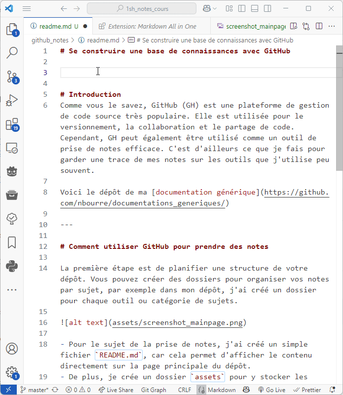

# Se construire une base de connaissances avec GitHub

- [Se construire une base de connaissances avec GitHub](#se-construire-une-base-de-connaissances-avec-github)
- [Introduction](#introduction)
- [Comment utiliser GitHub pour prendre des notes](#comment-utiliser-github-pour-prendre-des-notes)
- [Le contenu des notes](#le-contenu-des-notes)

# Introduction
Comme vous le savez, GitHub (GH) est une plateforme de gestion de code source très populaire. Elle est utilisée pour le versionnement, la collaboration et le partage de code. Cependant, GH peut également être utilisé comme un outil de prise de notes efficace. C'est d'ailleurs ce que je fais pour garder une trace de mes notes sur les outils que j'utilise peu souvent.

Voici le dépôt de ma [documentation générique](https://github.com/nbourre/documentations_generiques/)

---

# Comment utiliser GitHub pour prendre des notes

La première étape est de planifier une structure de votre dépôt. Vous pouvez créer des dossiers pour organiser vos notes par sujet, par exemple dans mon dépôt, j'ai créé un dossier pour chaque outil ou catégorie de sujets.

- Pour le sujet de la prise de notes, j'ai créé un simple fichier `README.md`, car cela permet d'afficher le contenu directement sur la page principale du dépôt.
- De plus, je crée un dossier `assets` pour y stocker les images que j'utilise dans mes notes. Cela permet de garder une structure claire et organisée. Cela facilite aussi le déplacement de la documentation au besoin.

---

# Le contenu des notes
Étant donné que ce sont des notes personnelles, je n'ai pas besoin de suivre une structure rigoureuse. Cependant, j'essaie de garder une certaine cohérence dans la manière dont je rédige mes notes. Voici quelques conseils :
- Utilisez des titres et des sous-titres pour structurer vos notes.
- Utilisez des listes à puces pour les points importants.
- Utilisez des outils de formatage Markdown tel que [Markdown All in One](https://marketplace.visualstudio.com/items?itemName=yzhang.markdown-all-in-one)
  - Cet outil permet, entres autres, de créer des tables de matières automatiquement ou encore des tableaux.
- Ne rédigez que les éléments qui ne sont pas nécessairement évidents pour vous. Par exemple, si vous utilisez un outil régulièrement, il n'est pas nécessaire de noter les étapes de base. Concentrez-vous sur les fonctionnalités avancées ou les astuces que vous avez découvertes.

