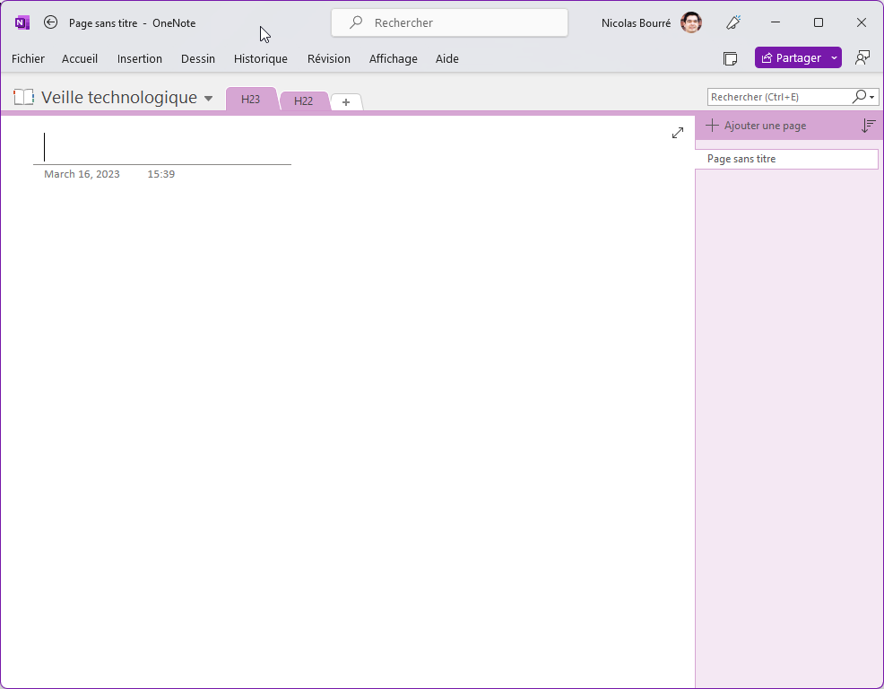
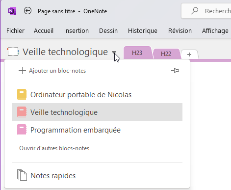
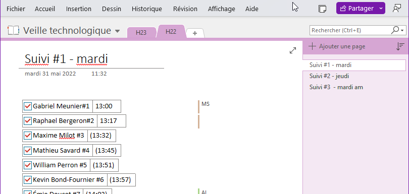

# L'utilité et l'utilisation de OneNote pour les étudiants de niveau collégial <!-- omit in toc -->

# Table des matières <!-- omit in toc -->
- [Introduction](#introduction)
- [Avantages de OneNote](#avantages-de-onenote)
- [Concepts](#concepts)
  - [Bloc-notes](#bloc-notes)
  - [Sections](#sections)
  - [Pages](#pages)
- [Organisation des notes](#organisation-des-notes)
- [Exemple d'organisation d'un bloc-notes](#exemple-dorganisation-dun-bloc-notes)
- [Conclusion](#conclusion)

# Introduction

OneNote est un outil de prise de notes et d'organisation numérique développé par Microsoft. Il est particulièrement utile, car il facilite la gestion des informations et la collaboration entre pairs. Dans ce document, nous explorerons les avantages de OneNote et comment l'utiliser pour organiser un bloc-notes dédié à un cours intitulé "Veille technologique".

# Avantages de OneNote

1. Organisation facile
2. Recherche rapide
3. Collaboration en temps réel
4. Intégration multimédia
5. Synchronisation sur plusieurs appareils
6. Fonctionnalités d'annotation

# Concepts
Dans OneNote, il y a différentes façons d'organiser les informations. Ce qu'il faut comprendre ce sont les concepts de bloc-notes, de section et de page.

## Bloc-notes
Un bloc-notes est un ensemble d'informations organisées. Il peut contenir plusieurs sections et plusieurs pages. Un bloc-notes peut être utilisé pour organiser les notes d'une session de cours, par exemple.

Dans l'exemple ci-contre, on y voit 3 bloc-notes. Le premier bloc-notes est intitulé "Ordinateur portable de Nicolas". Le deuxième bloc-notes est intitulé "Veille technologique". Le troisième bloc-notes est intitulé "Programmation embarquée".

## Sections
Une section est un ensemble de pages. Une section peut être utilisée pour organiser les notes d'un cours, par exemple.

Dans un bloc-notes, ils sont représentés par des onglets. Dans l'exemple ci-contre, on y voit 2 sections soit "H23" et "H22".

## Pages
Une page est un ensemble d'informations. Une page peut être utilisée pour organiser les notes d'une section, par exemple.

Dans une section, les pages se présentent sous forme de vignettes. Dans l'exemple ci-contre, on y voit 3 pages soit "Suivi #1 - mardi", "Suivi #2 - jeudi" et "Suivi #3 - mardi am".

# Organisation des notes
Il y a plusieurs façons d'organiser les notes dans OneNote. La manière d'organiser l'information dépend de la façon dont vous préférez travailler. Voici quelques exemples d'organisation des notes.

- Par date
- Par sujet
- Par projet

Dans l'exemple présenté dans ce document, nous allons organiser les notes par sujet. Cela signifie que nous allons créer une section pour chaque sujet. Dans chaque section, nous allons créer une page pour chaque leçon.

# Exemple d'organisation d'un bloc-notes
Voici un exemple pour un cours intitulé "Veille technologique".

1. Bloc-notes : Veille technologique
   - Section 1 : Recherche efficace de sources d'information
       - Page 1.1 : Méthodes de recherche
       - Page 1.2 : Sources d'information fiables
       - Page 1.3 : Mots-clés et requêtes de recherche

   - Section 2 : Utilisation appropriée des outils de veille
       - Page 2.1 : Outils de veille en ligne
       - Page 2.2 : Réseaux sociaux et forums
       - Page 2.3 : Flux RSS et newsletters

   - Section 3 : Analyse juste de l'information recueillie
       - Page 3.1 : Évaluation de la pertinence
       - Page 3.2 : Tri et organisation des informations
       - Page 3.3 : Techniques de synthèse

   - Section 4 : Détermination judicieuse des technologies à expérimenter
       - Page 4.1 : Identification des besoins
       - Page 4.2 : Critères de sélection
       - Page 4.3 : Méthodes d'évaluation et de test

   - Section 5 : Travaux de groupe et projets
       - Page 5.1 : Planification des projets
       - Page 5.2 : Communication et collaboration
       - Page 5.3 : Présentations et rapports

TODO : Completer les notes de cours

# Conclusion

OneNote est un outil précieux pour les personnes qui utilisent des ordinateurs, car il facilite l'organisation des notes, la collaboration et l'accès aux informations.

Il permet de facilement retrouver de l'information qui a été colligée sur plusieurs périodes de temps. Dans le cadre de notre cours, il sera utilise pour le travail de recherche que vous aurez à effectuer.
